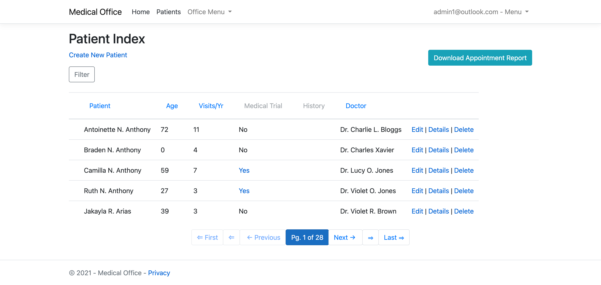
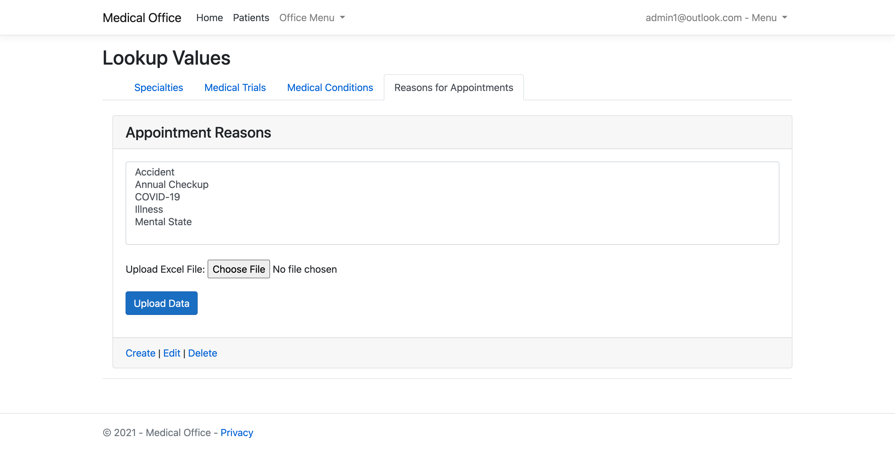
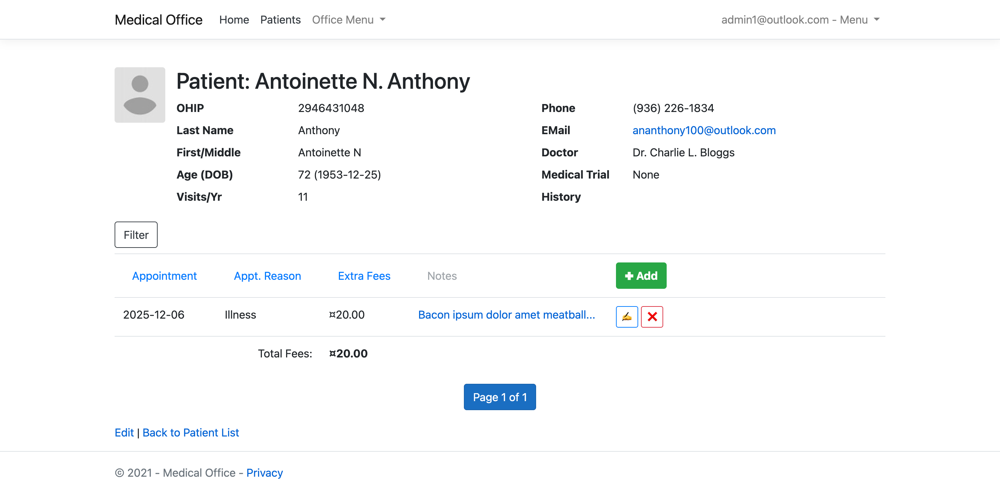

# MedicalOffice

ASP.NET Core Patient Management System

## Testing Credentials

Use the following account for local testing:

- **Email:** admin1@outlook.com
- **Password:** password

## Visuals

